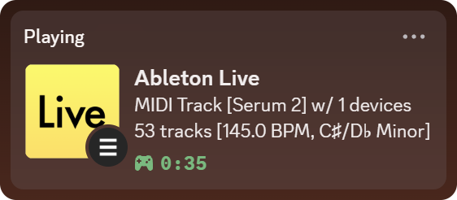
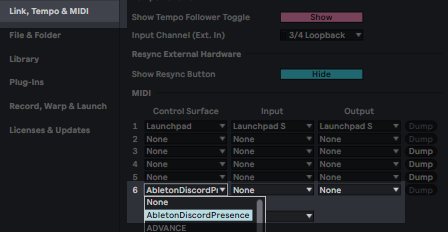

# AbletonDiscordPresence

A custom _remote script_ ("control surface") that displays your Ableton Live activity in Discord Rich Presence.

_Tested on multiple Live 12 versions; should work on Live 11 too, probably doesn't on Live 10_

## Installation

> Official guide: https://help.ableton.com/hc/en-us/articles/209072009-Installing-third-party-remote-scripts

1. **Clone this repo (or unzip) into `User Library/Remote Scripts`:**

   - **Windows**: `C:\Users\[username]\Documents\Ableton\User Library\Remote Scripts`
   - **macOS**: `/Users/[username]/Music/Ableton/User Library/Remote Scripts`

   The folder containing `__init__.py` should be the one you place there.

   Restart Live.

2. **In Live's "Link, Tempo & MIDI" settings assign this control surface to an empty slot (leave None, None):**

   

   To disable the script, just unselect it in this window.
